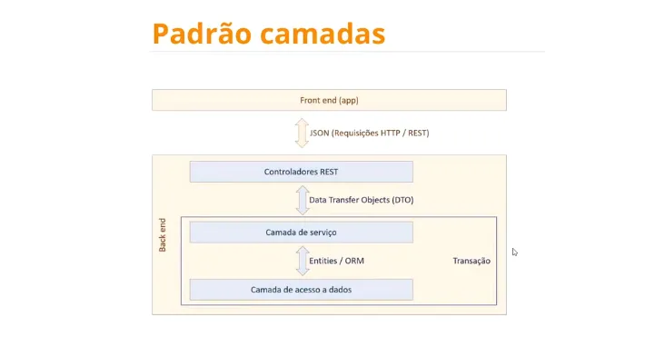

# Lista de games DSlist

### Projeto criado na imersão Java com Spring do professor
Nélio Alves.

## Objetivo:
Criar uma aplicação WEB baseado em arquitetura de camadas
(layered architecture), utilizando o banco de dados H2 para
criar um ambiente de teste e PostgreSQL em Docker para simular
um ambiente de produção.

### Ferramentas utilizadas:
* Java
* Spring com Spring Initializr
  * Spring Web
  * Spring Data JPA
  * H2 Database
  * PostgreSQL Driver
* PostgreSQL
* Docker
* Postman

## Arquitetura em camadas

Em um padrão de arquitetura em camadas, nós organizamos
a aplicação em camadas separadas, onde cada camada tem
uma responsabilidade específica e se comunica apenas com
a camada diretamente abaixo ou acima dela. 

**A aplicação foi implementada utilizando um conceito de organização em Modules e Packages**

### Esse projeto foi dividido em três camadas:
* Repository
  * Responsável pela persistência de dados (acesso ao banco), trabalha diretamente com as Entities que são ORM's.
* Service
  * Responsável pela regra do negócio, recebe Entities do Repository, trabalha com elas, transforma em DTO's e envia para o Controller.
* Controller
  * Responsável pela entrada e saída de dados da aplicação (via API REST), trabalha exclusivamente com DTO's.

