# Lista de games DSlist

### Projeto criado na imersão Java com Spring do professor
Nélio Alves.

## Objetivo:
Criar uma aplicação WEB baseado em arquitetura de camadas
(layered architecture), utilizando o banco de dados H2 para
criar um ambiente de teste e PostgreSQL em Docker para simular
um ambiente de produção.

### Ferramentas utilizadas:
* Java
* Spring com Spring Initializr
  * Spring Web
  * Spring Data JPA
  * H2 Database
  * PostgreSQL Driver
* PostgreSQL
* Docker
* Postman

## Arquitetura em camadas:

Em um padrão de arquitetura em camadas, nós organizamos
a aplicação em camadas separadas, onde cada camada tem
uma responsabilidade específica e se comunica apenas com
a camada diretamente abaixo ou acima dela.

**A aplicação foi implementada utilizando um conceito de organização em Modules e Packages**

### Esse projeto foi dividido em três camadas:
* Repository
  * Responsável pela persistência de dados (acesso ao banco), trabalha diretamente com as Entities que são ORM's.
* Service
  * Responsável pela regra do negócio, recebe Entities do Repository, trabalha com elas, transforma em DTO's e envia para o Controller.
* Controller
  * Responsável pela entrada e saída de dados da aplicação (via API REST), trabalha exclusivamente com DTO's.

### Estrutura das pastas em camadas:

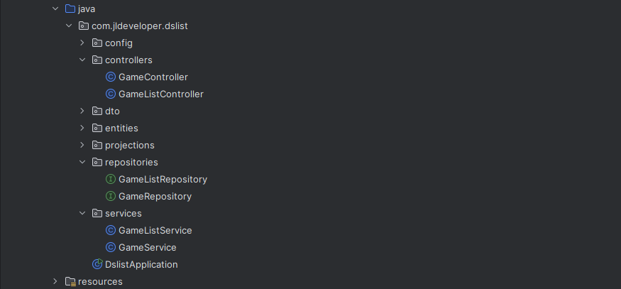

### Modelo de domínio:

### Ambiente de teste H2 Database

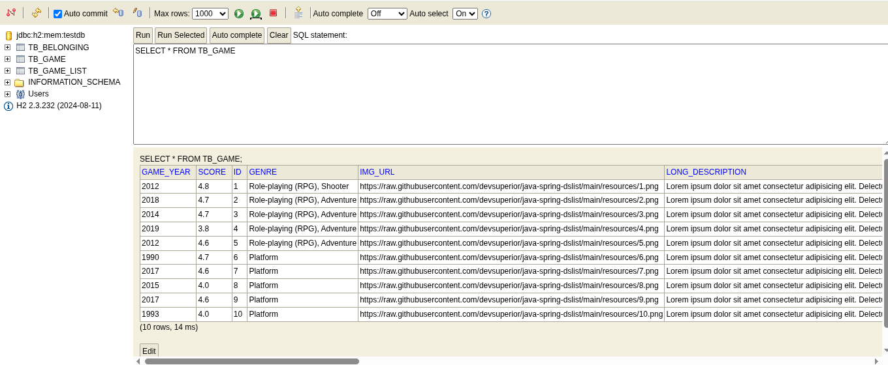

### Endpoint GET Games
Endpoint utilizado para puxar todos os games, porém
com informações de somente 5 de 9 campos

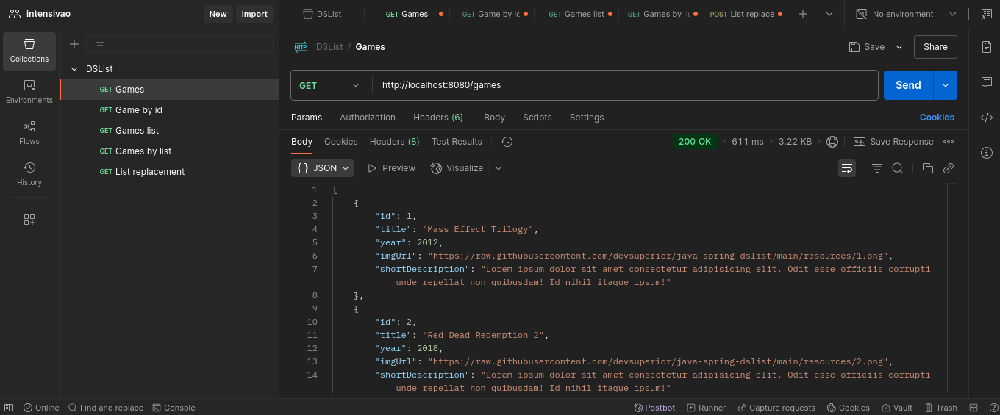

### Endpoint GET GamesByID
Endpoint utilizado para puxar um game específico com
todas as suas informações pelo seu ID

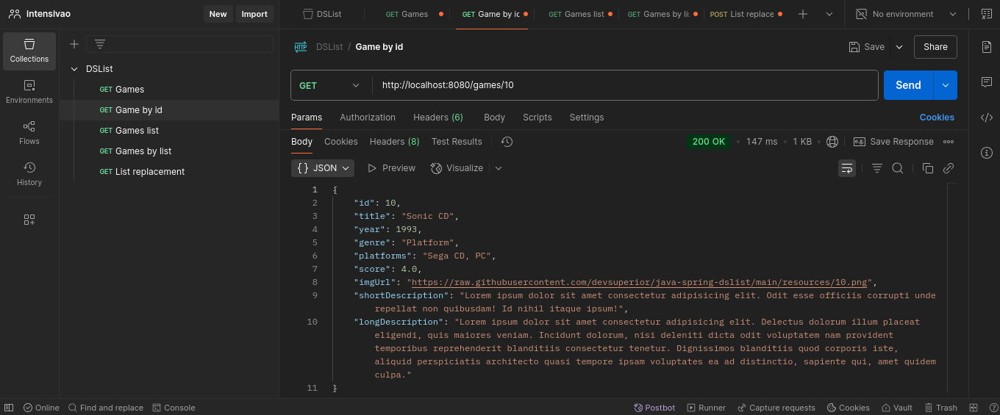

### Endpoint GET GamesList
Endpoint utilizado para puxar todas as listas de gêneros
de games

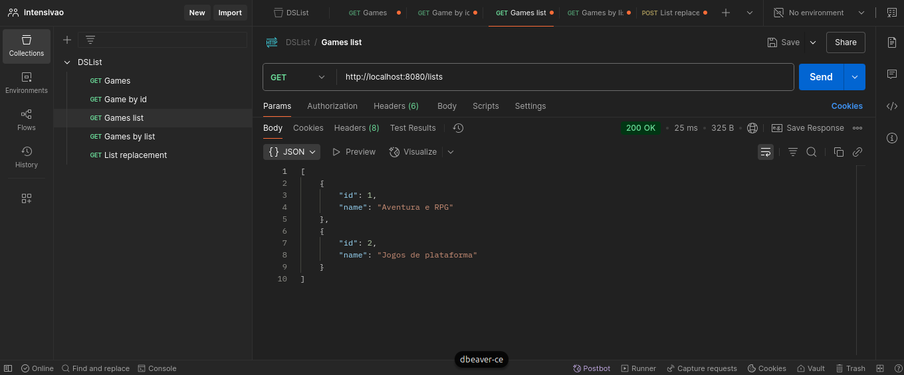

### Endpoint GET GamesByList
Endpoint utilizado para puxar os games por lista de gênero

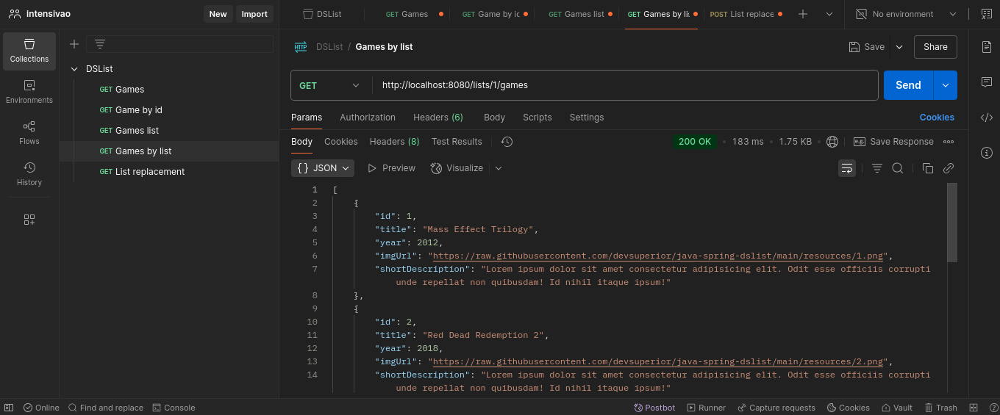

### Requisição para mudar o posição de um game na lista
Foi desenvolvido na aplicação um método para alterar a 
posição de um game dentro da lista

#### consulta SQL para visualizar as posições de um game na lista
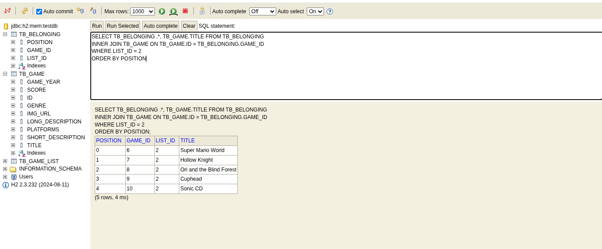
para alterar a posição temos um
método HTTP de POST com dados de origem da posição e
destino da posição

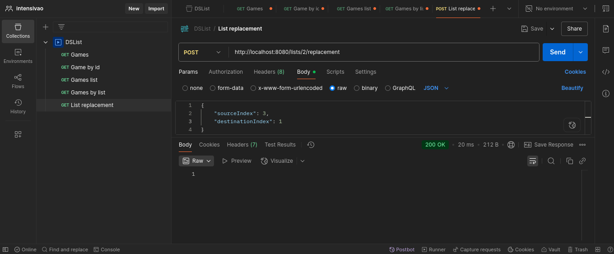

Assim, alterando a posição do game "Cuphead" na posição
3 para a posição 1

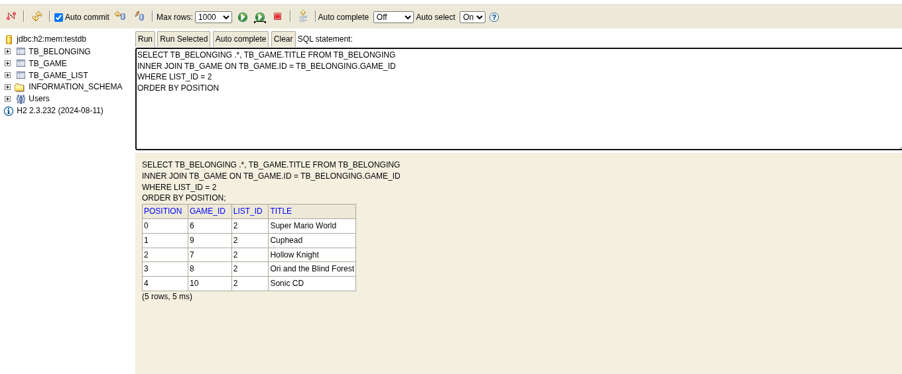

## Ambiente simulado de produção
Para simular um ambiente de produção foi criado um container
no Docker para carregar um banco de dados do PostgreSQL que 
realiza a mesma função do nosso banco de testes H2

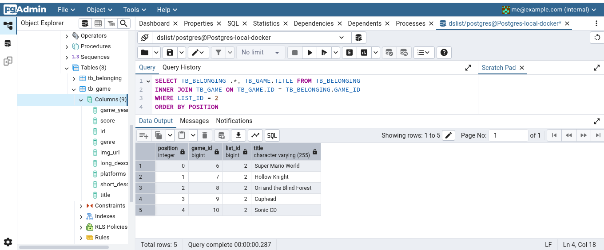

Podemos realizar a mesma requisição para alterar a
posição de algum game na lista

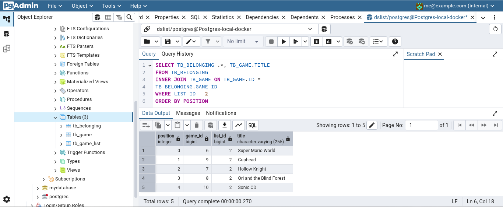

Através do banco de dados do PostegreSQL inserimos
mais uma lista em nosso banco de dados "ID: 3, name: Esportes" , podemos ver se
de fato foi inserida corretamente através do Postman

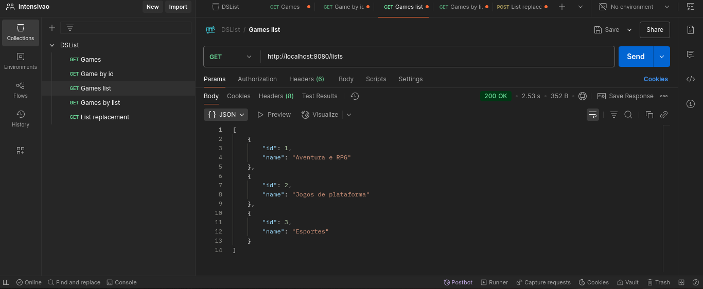

